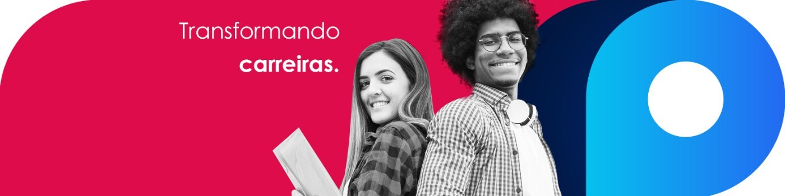

# Developer Jobs

## What we do?

- We help
  people [transform their lives through education](https://forbes.com.br/forbes-tech/2020/07/fintech-e-plataforma-de-educacao-anunciam-programa-para-estudantes-de-medicina/)
- We help
  people [to do a course them have always dreamed with but was never being able to pay for it](https://6minutos.uol.com.br/minhas-financas/conheca-a-provi-a-fintech-que-analisa-sua-perspectiva-de-carreira-na-hora-de-emprestar/)
- We
  help [medical students finish their graduation with allowance](https://blog.provi.com.br/institucional/provi-fintech-acesso-a-educacao/)
- We help
  people [to study without paying until they get a job](https://medium.com/@avbaraldi/o-que-%C3%A9-income-share-agreement-isa-1539eb015267)
- We build **high scalable microservices** so our students and partners have an amazing experience from beginning to
  finish
- We build **amazing frontend platforms** that allow anyone to request a loan
- We build **a strong engineer culture** so anyone who join the rocket can learn and grow a lot
- We use [the best tools for software development available out there](./tools/tools.md)
- Want to know more about us?
    - [LinkedIn](https://www.linkedin.com/company/provi)
    - [Instagram](https://www.instagram.com/sejaprovi/?hl=pt)
    - [Website](https://provi.com.br/)
    - [Blog](https://blog.provi.com.br/)
    - [Career page on Notion](https://provi.com.br/carreiras)

## Team

You will work in a very engaged team, working in an agile environment and delivering high quality software from ground
up

👉 What is **normal** here:

- to build new products
- to build new microservices
- to automate stuff
- to solve scalability problems
- to improve our existing products every day

👉 What is **not normal** here:

- to not have a growth mindset
- to not like changes
- to feel disconnected from the business world as a developer

👉 [What our team likes to use/study and you may learn a little with us in the journey](./tools/tools.md)

# Jobs

We have 3 types of jobs available at Provi Tech Team: [**backend**](#backend), [**frontend**](#frontend) and
[**fullstack**](#fullstack). If you indicate an awesome developer, and he/she get hired, we pay you R$ 1000,00

## Base requirements for all positions

All positions require:

- [ ] Knowledge of javascript
- [ ] Knowledge of git
- [ ] Knowledge of terminal/shell
- [ ] Passion to learn new things and solve complex problems
- [ ] Proactivity
- [ ] Curiosity and interest in business rules and logic
- [ ] Great english (fell comfortable writing, reading and googling)
- [ ] Deeply desire for professional growth
- [ ] Great communication (verbal and writing)
- [ ] Understanding of the education and financial market
- [ ] Problem solving skills (using google, stack overflow, github, slack, and so on in a smart way)

# Backend

## Description

Backend developers will work on multiple projects to solve hard backend problems using Javascript, Nodejs, Express,
MongoDB, Postgres, Python and AWS. They will deploy all these projects using these tools: Docker, ECS, GitHub Actions.

## Backend requirements

- [ ] [All the base requirements](#base-requirements-for-all-positions)
- [ ] Knowledge of Nodejs
- [ ] Knowledge of REST api
- [ ] Knowledge of database modeling
- [ ] Knowledge of MongoDB
- [ ] Knowledge of Postgres/SQL
- [ ] Understanding of tests and a testing framework (mocha, chai, jest or any other similar)
- [ ] Good to know: Docker, AWS, understanding of distributed systems, Python (not required)
- [ ] [Challenge](./backend/challenge.md)

# Frontend

## Description

Frontend developers will work on multiple projects to solve hard frontend and mobile problems using React, Gatsby and
Context API.

## Frontend requirements

- [ ] [All the requirements listed above](#base-requirements-for-all-positions)
- [ ] Worked with React in production for at least six months
- [ ] Knowledge of Flexbox, styling and css
- [ ] Knowledge of state management (it can be Redux, Mobx, ContextAPI or any related state management framework)
- [ ] Experience working as a frontend developer in a production project for at least 1 year
- [ ] [Challenge](./frontend/challenge.md)

# FullStack

## Description

Fullstack developers build, test and deliver a backend and frontend parts of projects, having a global overview of the
whole project and business rules.

## Requirements

- [ ] [All the requirements for backend developers](#backend-requirements)
- [ ] [All the requirements for frontend developers](#frontend-requirements)
- [ ] Experience working as a full stack developer in a production project for at least 1 year
- [ ] [Challenge](./fullstack/challenge.md)

# Steps of our application process

**1** - Choose which position fits you best and start the challenge

**2** - Once you finish the challenge, send it to us using an email we can reach you

**3** - Wait 3 business days (maximum)

**4** - We will reach you:

- We'll e-mail you details about the next steps in case your challenge achieves a high technical level
- In case your challenge doesn't achieve the desired level, we will send a technical review, so you can improve your
  skills 💪

**5** - What we will expect from you in the next steps of the application process if your challenge **do achieve a high
technical level**:

- You know what [tools](./tools/tools.md) we love to use
- You researched about our business model, big numbers, main partners, website and social networks
- You tested our product. You fell comfortable to discuss the strong/weak points
- You fell very comfortable with all of the [base requirements](#base-requirements-for-all-positions)
